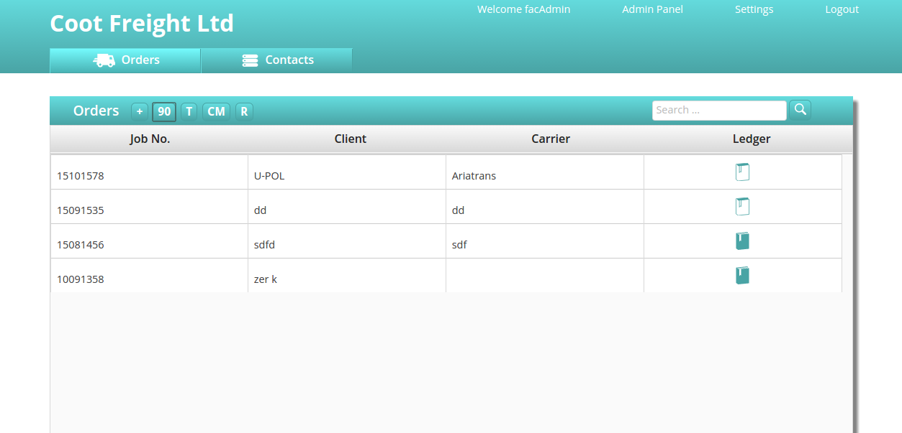
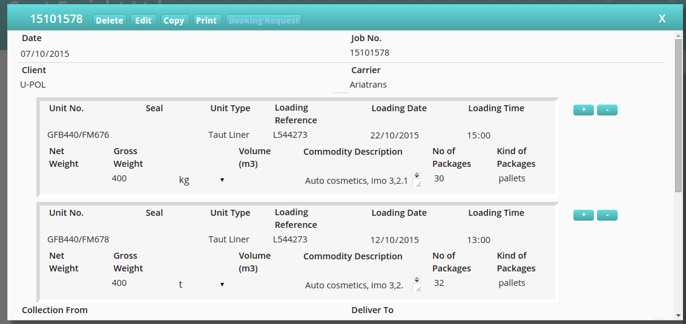
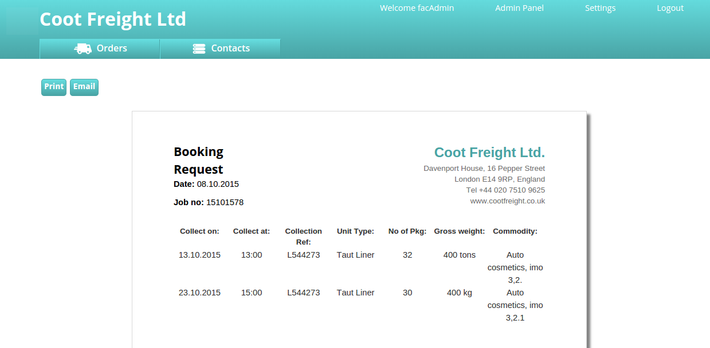
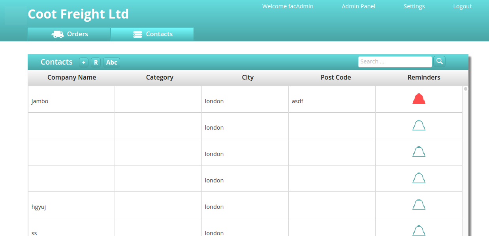
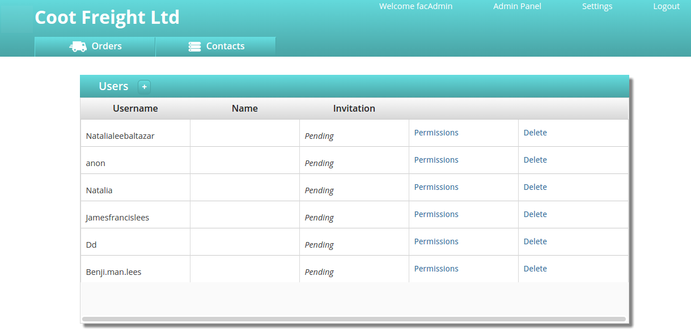

### An Inventory Management System

After contracting at Playabl I decided to come back to founders and coders to work on an open source inventory management system for a freight company.

The system is now integral to the workings of the business and contains quit allot of functionality including:

- Invoice System
- Orders System
- Reminders Functionality
- Contacts System
- Multiple Permissions

### Landing Page
The book icon resembles a invoice which changes color when an invoice is made.

### Edit Order

### Booking Request
Email and print a automatically generated booking request.

### Contacts and Reminders
The bell icon resembles a reminder which changes color in relation to urgency.

### Admin

#### Technology Stack
- React.js
- Node.js
- Tape (testing)

#### Tools
- Selenium (testing)
- Travis (continuous deployment)

#### Links
- [Repo](https://github.com/foundersandcoders/carrier-pigeon)
