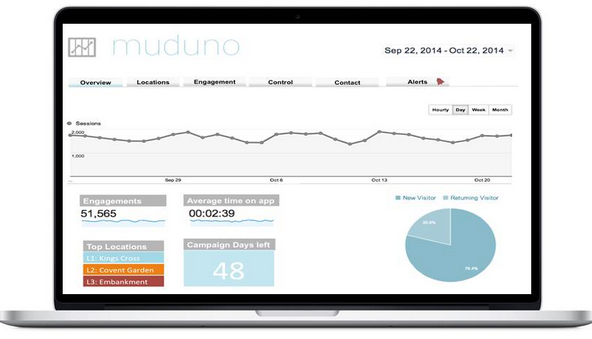

###A prototype for pitching

After finishing the [founders and coders](http://www.foundersandcoders.com/) I started building a prototype for a company called [Muduno](http://www.muduno.com/). 

Muduno are involved in using augmented reality and outdoor media to optimize outdoor advertising. The tool that we built them was a prototype for the businesses side. The main objective was to create an enjoyable medium for businesses to view data related to particular advertisements.

###Landing Page

Unfortunately due to privacy reasons I am only able to show the landing page for this project. 

####Technology Stack
- Angular.js
- Node.js
- D3.js
- Jasmine
- Karma