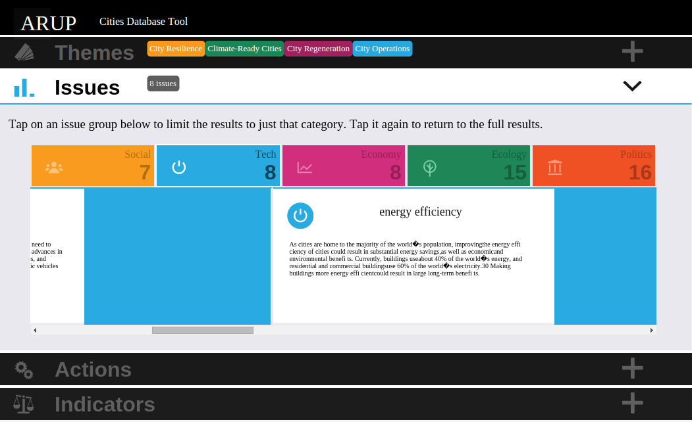

### Pitching Tool

This is a tool that Arup hope to use to help with their pitching. It provides clients with an interactive way of finding out how Arup can help improve their city.

This was my first project that was built using es6. The app is a single page app designed for desktop and tablet.

### Landing Page Desktop

### Landing Page tablet

### Themes Desktop
Themes are the first option to filter by selecting a theme filters all data for a specific or multiple themes.

### Issues Tablet
Issues are a filter option within themes

### Actions Destop
Actions are a filter option within issues

#### Technology Stack
- React.js
- sass
- es6
- tape (testing)
- jsdom (testing)

#### Tools
- Codeship (continuous deployment)
