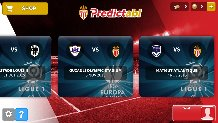
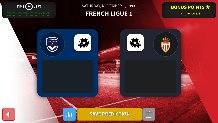

### An Android and iPhone football game

After working at Founders and Coders for a few months on various projects I decided to go into contracting to gain a bit of experience working in a larger team.

At [Playabl](https://www.linkedin.com/company/playabl) I was involved in building an Android and iPhone game in JavaScript, HTML and CSS using Cordova. The game, [Predictabl](https://asmonaco.playabl.com/fr-fr/), is an exclusive prediction game for clubs including Monaco, Wolves and many more.

### Landing Page

### Join A League

### League

#### Technology Stack
- Angular.js
- Node.js
- Ionic

#### Tools
- Cordova
- Xcode
