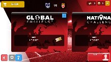

### An android and Iphone football game

After finishing the [founders and coders](http://www.foundersandcoders.com/) I started building a prototype for a company called [Muduno](http://www.muduno.com/).

Muduno are involved in using augmented reality and outdoor media to optimize outdoor advertising. The tool that we built them was a prototype for the business's side. The main objective was to create an enjoyable medium for businesses to view data related to particular advertisements.

### Landing Page

### Join A League

### League

#### Technology Stack
- Angular.js
- Node.js
- Ionic

#### Tools
- Cordova
- Xcode
